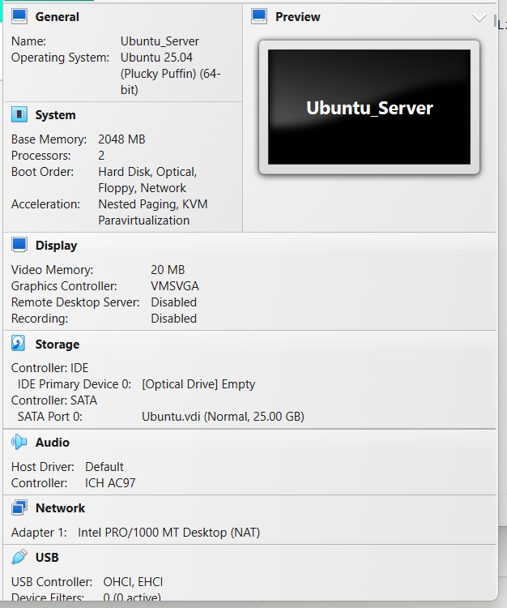
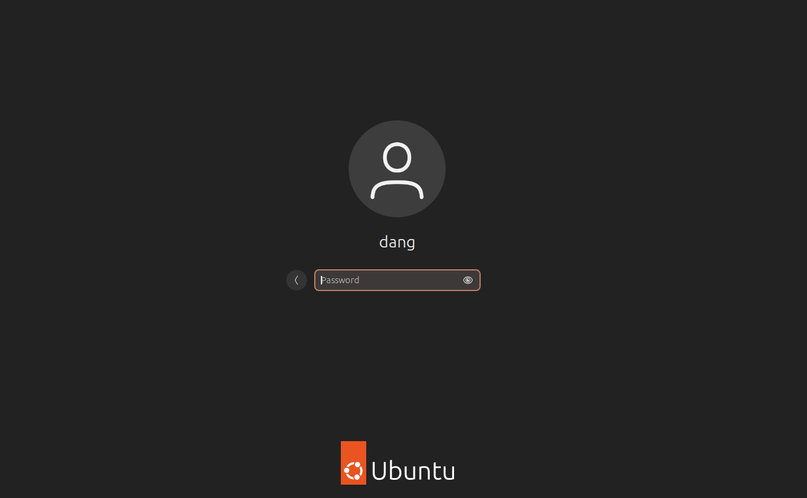
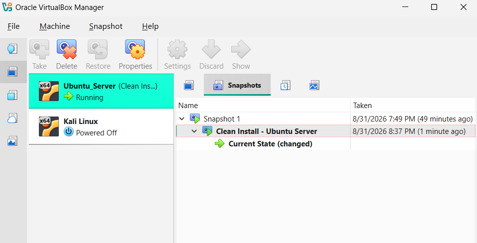

##Week 2 - Ubuntu SErver Installation

##Ubuntu Server VM
- VM Name: Ubuntu_Server
- TYpe: Linux
- Version: Ubuntu (64-bit)
- RAM: 2048 MB
- CPU: 2 Cores
- Storage: 25 GB VDI, dynamically allocated
- ISO: Ubuntu Server 25.04
- Language: English
- OpenSSH Server: Installed
- Username: dang
- Network: Enabled
- Snapshot: Clean Install - Ubuntu Server

##Installation Steps
1. Created a new virtual machine named Ubuntu_Server.
2. Selected Linux as the operating system type and Ubuntu (64-bit) as the version.
3. Allocated 2048 MB of RAM and 2 CPU cores.
4. Created a 25 GB dynamically allocated VDI.
5. Attached the Ubuntur Server 25.04 ISO.
6. Started the virtual machine and installed Ubuntu Server.
7. Installed OpenSSH Server during the installation.
8. Created the required user account.
9. Enabled the network connection.
10. Successfully loged in to Ubuntu Server.
11. Created a snapshot named "Clean Install - Ubuntu Server"

##SCREENSHOTS

#Ubuntu Server VM Settings

#Succesful Ubuntu Server Login

#Ubuntu Server Snapshot

